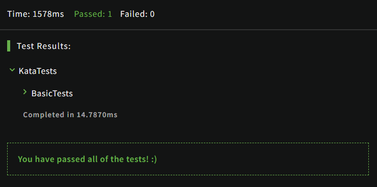

4-21

- [x] 10 8 kyu
- [x] 2 7 kyu
- [x] 1 6 kyu

## 1. 8 kyu

### 1.1 [To square(root) or not to square(root)]([To square(root) or not to square(root) Solutions | Codewars](https://www.codewars.com/kata/57f6ad55cca6e045d2000627/solutions/csharp/me/best_practice))

#### 1.1.1 Description

Write a method, that will get an integer array as parameter and will process every number from this array.

Return a new array with processing every number of the input-array like this:

If the number has an integer square root, take this, otherwise square the number.

#### 1.1.2 Example

```
[4,3,9,7,2,1] -> [2,9,3,49,4,1]
```

#### 1.1.3 Notes

The input array will always contain only positive numbers, and will never be empty or null.

#### 1.1.4 My Solutions

```c#
public class Kata
{
  public static int[] SquareOrSquareRoot(int[] array)
  {
    bool isSquare;
    for(int i = 0; i < array.Length; i++)
    {
      isSquare = true;
      for(int j = 1; j < array[i]; j++)
      {
        if(j * j == array[i])
        {
          array[i] = j;
          isSquare = false;
          break;
        }
      }
      if(isSquare)
      {
        array[i] *= array[i]; 
      }
    }
    return array;
  }
```



disadvantage is obvious,it can not understand easily.

#### 1.1.5 Best Practice

use Linq with Lambda

```c#
using System;
using System.Linq;

public class Kata
{
  public static int[] SquareOrSquareRoot(int[] array)
  {
    return array.Select(x => (int)(Math.Sqrt(x) % 1 == 0 ? Math.Sqrt(x) : x * x)).ToArray();
  }
}
```

> 余数指的是整数除法中被除数未被除尽部分，比如说7÷3=2 ......1，其中1为余数；
>
> 注意类型转换；


### 1.2  Check same case

#### 1.2.1 Description

Write a function that will check if two given characters are the same case.

- If either of the characters is not a letter, return `-1`
- If both characters are the same case, return `1`
- If both characters are letters, but not the same case, return `0`

#### 1.2.2 Examples

'a'` and `'g'` returns `1
'A'` and `'C'` returns `1
'b'` and `'G'` returns `0
'B'` and `'g'` returns `0
'0'` and `'?'` returns `-1

#### 1.2.3 My Solutions

```c#
using System;
public class Kata {
  public static int SameCase(char a, char b) {
    if(!Char.IsLetter(a) || !Char.IsLetter(b))
    {
      return -1;
    }
    else
    {
      if(Char.IsLower(a) && Char.IsLower(b) || Char.IsUpper(a) && Char.IsUpper(b))
      {
        return 1;
      }
      else
      {
        return 0;
      }
    }
    return 0;
  }
}
```

#### 1.2.4 Best Practice

```c#
public class Kata {
  public static int SameCase(char a, char b) 
  {
    if (!char.IsLetter(a) || !char.IsLetter(b))
      return -1;
    return char.IsLower(a) == char.IsLower(b) ? 1 : 0; 
  }
}
```

> 使用三元表达式可以简化程序,也更容易看懂程序;

```c#
public class Kata {
  public static int SameCase(char a, char b) {
    string alphabet = "abcdefghijklmnopqrstuvwxyzABCDEFGHIJKLMNOPQRSTUVWXYZ";
    
    int aIndex = alphabet.IndexOf(a);
    int bIndex = alphabet.IndexOf(b);
    
    if (aIndex < 0 || bIndex < 0) {
      return -1;
    } else if ((aIndex <= 25 && bIndex <= 25) || (aIndex >= 26 && bIndex >= 26)) {
      return 1;
    } else {
      return 0;
    }
  }
}
```

> 这里不使用 char api;

### 1.3  Grasshopper - Summation

Write a program that finds the summation of every number from 1 to num. The number will always be a positive integer greater than 0.

For example:

```
summation(2) -> 3
1 + 2

summation(8) -> 36
1 + 2 + 3 + 4 + 5 + 6 + 7 + 8
```

```c#
using System;

public static class Kata 
{
  public static int summation(int num)
    {
      //Code here
  
  
      int result = 0;
  
      for (int i = 0; i <= num; i++)
      {
          result += i;
      }
  
      return result;
    }
}
```

> 实际上可以用求和公式：`return num*(num+1)/2;`

### 1.4 How good are you really?

There was a test in your class and you passed it. Congratulations!
But you're an ambitious person. You want to know if you're better than the average student in your class.

You receive an array with your peers' test scores. Now calculate the average and compare your score!

Return `True` if you're better, else `False`!

#### Note:

Your points are not included in the array of your class's points. For calculating the average point you may add your point to the given array!

```c#
public class Kata
{
  public static bool BetterThanAverage(int[] ClassPoints, int YourPoints)
  {
    int result = 0;
    for(int i = 0; i < ClassPoints.Length; i++)
    {
      result += ClassPoints[i];
    }
    result /= ClassPoints.Length;
    if(result > YourPoints)
    {
      return false;
    }
    return true;
  }
}
```

> 实际上可以使用 Linq，代码更加清晰易懂；

```c#
using System.Linq;
public class Kata
{
  public static bool BetterThanAverage(int[] ClassPoints, int YourPoints)
  {
    return ClassPoints.Average() < YourPoints;
  }
}
```

### 1.5  Fundamentals: Return

Make multiple functions that will return the sum, difference, modulus, product, quotient, and the exponent respectively.

Please use the following function names:

addition = **Add**

multiply = **Multiply**

division = **Divide**

modulus = **Mod**

exponential = **Exponent**

subtraction = **Subt**

**Note: All funcitons can return int and all will recieve 2 integers.**

*Note: All math operations will be: a (operation) b*

```c#
using System;
public static class Kata
{
 public static int Add(int a, int b)
{
    return (a + b);
}
 public static int Multiply(int a, int b)
{
    return (a * b);
}

public static int Divide(int a, int b)
{
    return (a / b);
}

public static int Mod(int a, int b)
{
    return (a % b);
}

public static int Exponent(int a, int b)
{
    return ((int)Math.Pow(a, b));
}

public static int Subt(int a, int b)
{
    return (a - b);
}
}
```

> 实际上使用 lambda 更加整洁；

```c#
using System;
public static class Kata
{
  public static int Add(int a, int b) => a + b;
  
  public static int Subt(int a, int b) => a - b;

  public static int Multiply(int a, int b) => a * b;
    
  public static int Divide(int a, int b) => a / b;

  public static int Mod(int a, int b) => a % b;

  public static int Exponent(int a, int b) => Convert.ToInt32(Math.Pow(a,b));

}
```

### 1.6 Name Shuffler

Write a function that returns a string in which firstname is swapped with last name.

```csharp
Kata.NameShuffler("john McClane") => "McClane john"
```

#### 1.6.1 My Solution

```c#
using System;

public class Kata
{   
  public static string NameShuffler(string str)
  {
    string[] result = str.Split(" ");
    string end = "";
    for(int i = 0; i < result.Length; i++)
    {
      if(i == result.Length - 1)
      {
        end += result[result.Length - i - 1];
        break;
      }
      end += result[result.Length - i - 1] + " ";
    }
    return end;
  }
}
```


#### 1.6.2 Best Practice

```c#
using System.Linq;

public class Kata
{   
  public static string NameShuffler(string str)
  {
    return string.Join(' ', str.Split(' ').Reverse());
  }
}
```

> 实际上使用 Linq 处理简单易懂；
>
> string 是 c# 的类和关键字，在编译时会被编译成 .net 框架的String，使用两者都一样，不过用 string 规范些；
>
> string.Join() 连接指定数组的元素或集合的成员，在每个元素或成员之间使用指定的分隔符；
>
> string.Split() 用来分隔字符串为数组；
>
> Array.Reverse() 翻转数组； 
>
> 使用 api 注意对象的类型和返回的类型；

### 1.7 Short Long Short

Given 2 strings, `a` and `b`, return a string of the form short+long+short, with the shorter string on the outside and the longer string on the inside. The strings will not be the same length, but they may be empty ( `zero` length ).

Hint for R users:

> The length of string is not always the same as the number of characters

For example: **(Input1, Input2) --> output**

```
("1", "22") --> "1221"
("22", "1") --> "1221"
```

#### 1. My Solutions

```c#
public class ShortLongShort
{
  public static string Solution(string a, string b)
  {
    int aLength = a.Length;
    int bLength = b.Length;
    string result = "";
    
    if(aLength < bLength)
    {
      result = a + b + a;
      return result;
    }
    result = b + a + b;
    return result;
  }
}
```

#### 1.7.2 Best Practice

```C#
public class ShortLongShort
{
  public static string Solution(string a, string b)
  {
    return (a.Length > b.Length) ? (b + a + b) : (a + b + a);
  }
}
```

> 使用三元表达式简单易懂；

### 1.8 String cleaning

Your boss decided to save money by purchasing some cut-rate optical character recognition software for scanning in the text of old novels to your database. At first it seems to capture words okay, but you quickly notice that it throws in a lot of numbers at random places in the text.

**Examples (input -> output)**

```
'! !'                 -> '! !'
'123456789'           -> ''
'This looks5 grea8t!' -> 'This looks great!'
```

Your harried co-workers are looking to you for a solution to take this garbled text and remove all of the numbers. Your program will take in a string and clean out all numeric characters, and return a string with spacing and special characters `~#$%^&!@*():;"'.,?` all intact.

#### 1.8.1 My Solution

```c#
public class Kata
{
  public static string StringClean(string s)
  {
    // Function will return the cleaned string
    string nums = "0123456789";
    string result = "";
    for(int i = 0; i<s.Length; i++)
    {
      if(nums.Contains(s[i]))
      {
        continue;
      }
      result += s[i];
    }
    return result;
  }
}
```

#### 1.8.2 Best Practice

```c#
using System.Text.RegularExpressions;
public class Kata
{
    public static string StringClean(string s) => Regex.Replace(s, @"\d", "");
}
```

> 字符串匹配模式使用了 @
>
> * 逐字字符串
> * 不进行转义
>
> 使用了正则表达式；
>
> * [Regex.Replace 方法 (System.Text.RegularExpressions) | Microsoft Docs](https://docs.microsoft.com/zh-cn/dotnet/api/system.text.regularexpressions.regex.replace?view=net-5.0#system-text-regularexpressions-regex-replace(system-string-system-string-system-text-regularexpressions-matchevaluator))
>
> * [C# 正则表达式 | 菜鸟教程 (runoob.com)](https://www.runoob.com/csharp/csharp-regular-expressions.html)
> * 表明只要匹配到数字，就用空字符串替换；
>
> 使用Lambda表达式；

### 1.9  Stringy Strings

write me a function `stringy` that takes a `size` and returns a `string` of alternating `'1s'` and `'0s'`.

the string should start with a `1`.

a string with `size` 6 should return :`'101010'`.

with `size` 4 should return : `'1010'`.

with `size` 12 should return : `'101010101010'`.

The size will always be positive and will only use whole numbers.

#### 1.9.1 My Solutions

```c#
public class Kata
{
  public static string Stringy(int size)
  {
    // your code here
    string num = "1";
    string num2 = "0";
    string result = "";
    for(int i = 0; i < size; i++)
    {
      if(isEven(i))
      {
        result += num;
        continue;
      }
      result += num2;
    }
    return result;
  }
  public static bool isEven(int i)
  {
    return i % 2 == 0 ? true : false;
  }
}
```

#### 1.9.2 Best Practice

```c#
using System.Text;

public class Kata
{
  public static string Stringy(int size)
  {
      var result = new StringBuilder();
      for (var i = 1; i <= size; i++)
      {
          result.Append(i%2);
      }
      return result.ToString();
  }
}
```

> 使用 StringBuilder 类，是一种可变类型，与 String 类的区别在于，允许扩充它所封装的字符串中字符的数量，而不是在内存中创建一个新的字符串对象，为该新对象分配新的空间。

### 1.10  Find Multiples of a Number

In this simple exercise, you will build a program that takes a value, `integer `, and returns a list of its multiples up to another value, `limit `. If `limit` is a multiple of `integer`, it should be included as well. There will only ever be positive integers passed into the function, not consisting of 0. The limit will always be higher than the base.

For example, if the parameters passed are `(2, 6)`, the function should return `[2, 4, 6]` as 2, 4, and 6 are the multiples of 2 up to 6.

If you can, try writing it in only one line of code.

#### 1.10.1 My Solutions

```c#
using System.Collections.Generic;
using System;
public class Kata
{
  public static List<int> FindMultiples(int integer, int limit)
  {
    // Your code here!
    List<int> result = new List<int>();
    int times = limit / integer;
    int num = integer;
    for(int i = 0; i < times; i++)
    {
      result.Add(integer);
      integer += num;
    }
    // result.ForEach(s=> Console.WriteLine(s));
    return result;
  }
}
```

#### 1.10.2 Best Practice

```c#
using System.Collections.Generic;

public class Kata
{
  public static List<int> FindMultiples(int integer, int limit)
  {
    List <int> result = new List<int>();
    for (int i = integer; i <= limit; i += integer)
    {
      result.Add(i);
    }
    return result;
  }
}
```

```c#
using System.Linq;
using System.Collections.Generic;

public class Kata
{
  public static List<int> FindMultiples(int num, int limit) =>
     Enumerable.Range(1, limit / num)
               .Select(x => x * num)
               .ToList();
 }
```

> 使用 Linq；
>
> 使用枚举；

## 2. 7 kyu

### 2.1 Fibonacci

```c#
using System;
public class Fibonacci
{
    public static int fib(int n)
    {
           if (n==1||n==2)
            {
                return 1;
            }
            return fib(n - 1) + fib(n - 2);
    }
}
```

> 了解递归调用栈的执行过程；

### 2.2  Simple string characters

In this Kata, you will be given a string and your task will be to return a list of ints detailing the count of uppercase letters, lowercase, numbers and special characters, as follows.

```Haskell
Solve("*'&ABCDabcde12345") = [4,5,5,3]. 
--the order is: uppercase letters, lowercase, numbers and special characters.
```

More examples in the test cases.

Good luck!

#### 2.2.1 My Solutions

```c#
using System;

public class Solution
{
    public static int[] solve(String s){
      int Upper = 0;
      int Lower = 0;
      int numbers = 0;
      int sc = 0;
      for(int i = 0; i < s.Length; i++)
      {
        if(char.IsUpper(s[i]))
        {
          Upper++;
          continue;
        }
        if(char.IsLower(s[i]))
        {
          Lower++;
          continue;
        }
        if(char.IsNumber(s[i]))
        {
          numbers++;
          continue;
        }
        sc++;
      }
      int[] result = {Upper, Lower, numbers, sc};
      return result;
    }
}
```

#### 2.2.2 Best Practice

```c#
using System.Linq;

public class Solution
{
  public static int [] solve(string s)
  {
    return new[]
    {
        s.Count(char.IsUpper),
        s.Count(char.IsLower),
        s.Count(char.IsDigit),
        s.Count(x => !char.IsLetterOrDigit(x))
    };
  }
}
```

> 使用 Linq；
>
> 创建数组：new[] {}


## 3. 6 kyu

### 3.1 N-th Fibonacci

I love Fibonacci numbers in general, but I must admit I love some more than others.

I would like for you to write me a function that when given a number (n) returns the n-th number in the Fibonacci Sequence.

For example:

```csharp
   NthFib(4) == 2
```

Because 2 is the 4th number in the Fibonacci Sequence.

For reference, the first two numbers in the Fibonacci sequence are 0 and 1, and each subsequent number is the sum of the previous two.

#### 3.1.1 My Solutions & Best Practice

```c#
public class Fibonacci
{
  public int NthFib(int n)
  {
    if(n == 1)
    {
      return 0;
    }
    if(n == 2)
    {
      return 1;
    }
    // Return the n-th number in the Fibonacci Sequence
    return NthFib(n - 1) + NthFib(n - 2);
  }
}
```
